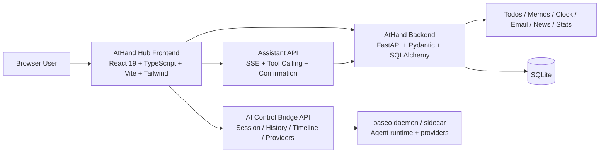

# AtHand

<p align="center">
  <strong>AI-native remote workspace for agent orchestration and personal execution</strong>
</p>

<p align="center">
  <a href="README.md">简体中文</a>
  ·
  <a href="athand-hub/README.md">AtHand Hub README</a>
</p>

AtHand is an AI-native remote workspace built to bring AI sessions, multi-machine runtimes, personal execution flows, and information streams into one working surface.

In this document:

- V1 means AtHand before the paseo and vibe-kanban integration
- V2 means the current AtHand with paseo-connected AI control and a vibe-kanban-style workspace

## Table of Contents

- [Overview](#overview)
- [Version Evolution](#version-evolution)
- [Screenshots](#screenshots)
- [Architecture](#architecture)
- [Repository Guide](#repository-guide)
- [References](#references)
- [Design Philosophy](#design-philosophy)
- [Core Capabilities](#core-capabilities)
- [Tech Stack](#tech-stack)
- [Implementation Notes](#implementation-notes)
- [Local Development](#local-development)
- [Current Status](#current-status)

## Overview

AtHand is not a single-feature application. It is an AI-first workspace designed to reorganize three systems that are usually fragmented:

- AI sessions, multi-machine runtimes, provider configuration, and resume flows
- personal execution modules such as todos, memos, clocking, email, news, and statistics
- confirmation, continuation, timeline, and context management required for real human-AI collaboration

V1 is closer to a personal workspace with AI features. V2 pushes the project further into an AI orchestration and execution hub.

## Version Evolution

| Version | Definition | Key traits |
| --- | --- | --- |
| V1 | AtHand before paseo and vibe-kanban integration | original AtHand Hub, monolithic workspace, legacy AI control path, integrated productivity tools |
| V2 | Current AtHand | paseo sidecar bridge, vibe-kanban-style AI board, timeline, unified workspace shell, embedded AI assistant |

Why the V1/V2 distinction matters:

- V1 marks the first product phase: get the personal workspace and baseline AI interaction working
- V2 marks the current direction: externalize runtime orchestration into paseo and reshape AI control into an observable workflow
- they are two phases of the same project, not two unrelated products

## Screenshots

<table>
  <tr>
    <td width="50%">
      
    </td>
    <td width="50%">
      
    </td>
  </tr>
  <tr>
    <td align="center"><strong>Dashboard overview</strong></td>
    <td align="center"><strong>AI control board</strong></td>
  </tr>
</table>

<p align="center">
  
</p>

<p align="center"><strong>Embedded AI assistant</strong></p>

These screenshots highlight three representative V2 surfaces: the dashboard, the vibe-kanban-inspired AI control board, and the global assistant sidecar.

## Architecture



This diagram represents V2: the frontend remains a unified workspace shell, while the AI runtime is now externalized and connected through a bridge-first API layer into the paseo daemon.

## Repository Guide

| Path | Purpose |
| --- | --- |
| [README.md](README.md) | Chinese project homepage |
| [athand-hub/](athand-hub/) | main application with FastAPI backend and React frontend |
| [athand-hub/README.md](athand-hub/README.md) | AtHand Hub subproject README |
| [paseo-main/](paseo-main/) | local paseo working copy used for integration |
| [vibe-kanban-main/](vibe-kanban-main/) | interaction and product-shape reference |
| [docs/screenshots/](docs/screenshots/) | screenshot assets used by the homepage |

## References

- [paseo](https://github.com/getpaseo/paseo): AtHand V2 uses paseo as the external agent runtime and daemon layer, and [paseo-main/](paseo-main/) in this repository is the local working copy used for integration and bridge development.
- [vibe-kanban](https://github.com/BloopAI/vibe-kanban): AtHand V2 explicitly references vibe-kanban for its AI control board, workspace orchestration, and timeline interaction model, and [vibe-kanban-main/](vibe-kanban-main/) in this repository is the local reference copy for product shape and interaction design.

## Design Philosophy

- AI-first, but not AI-only. AtHand does not isolate agent control from daily work.
- Human-in-the-loop. High-risk actions keep explicit review and confirmation, especially email sending.
- One desk, many runtimes. The user sees one desk, while the system can manage multiple machines, providers, and sessions underneath.
- Local-first pragmatism. The project favors working software and fast iteration over premature platform abstraction.
- Observable and resumable. AI control must support history, timeline, resume flows, and layered state rather than one-shot prompts only.

## Core Capabilities

- AI control across multiple machines and providers, including session creation, resume flows, timeline, history, and board-based status views
- embedded AI assistant with a global side panel, SSE streaming, tool calling, and confirmation-driven actions
- personal execution modules for todos, memos, clocking, and dashboard statistics
- information flow modules for email workspace, news workspace, daily briefs, and digests
- unified frontend shell with sidebar + workspace + detail-panel patterns, theme switching, partial collapsing, and independent scrolling

## Tech Stack

### Frontend

- React 19
- TypeScript
- Vite 5
- React Router 6
- Tailwind CSS
- React Markdown + remark-gfm
- DOMPurify

### Backend

- FastAPI
- Pydantic v2
- SQLAlchemy 2
- Alembic
- SQLite
- python-jose + passlib
- websockets + httpx
- feedparser + BeautifulSoup

### AI Runtime and Integration Layer

- paseo sidecar / daemon
- bridge-first AI control over WebSocket transport
- OpenAI-compatible model configuration and switching
- vibe-kanban-inspired session board and timeline interaction model

## Implementation Notes

### 1. Frontend workspace

AtHand Hub is currently implemented as a SPA. The major surfaces and backend boundaries are:

| Surface | Frontend entry | Backend entry | Purpose |
| --- | --- | --- | --- |
| Dashboard | `/` | `/api/stats` | aggregates local business data and AI bridge history |
| AI Control | `/agents` | `/api/ai-control` | session creation, resume flows, timeline, history, and provider management |
| Todos | `/todos` | `/api/todos` | task execution and list management |
| Memos | `/memos` | `/api/memos` | markdown note-taking and retrieval |
| Clock | `/clock` | `/api/clock` | work-hour records and rhythm tracking |
| Email | `/email` | `/api/email` | account, folder, queue, and composition workflow |
| News | `/news` | `/api/news` | sources, stream, briefs, and digests |
| Embedded Assistant | global side panel | `/api/assistant` | SSE chat, tool calls, and confirmation actions |

### 2. AI control path

The most important V2 shift is the bridge-first paseo integration:

1. The `/agents` page owns the board, list, timeline, and continue-conversation entry points.
2. FastAPI exposes machine listing, provider listing, session creation, message sending, session resume, timeline, and history under `/api/ai-control`.
3. [athand-hub/backend/services/ai_control_bridge.py](athand-hub/backend/services/ai_control_bridge.py) translates AtHand API models into paseo daemon WebSocket RPC calls.
4. paseo is responsible for the actual agent runtime and provider integration.
5. The frontend maps those states into a vibe-kanban-style workspace.

This is what turns AtHand from “a toolbox with an AI button” into something closer to a real agent orchestration product.

### 3. Embedded AI assistant

The embedded assistant is not a separate product. It is the global collaboration entry point inside AtHand:

- the frontend mounts `AssistantPanel` globally so the user can continue a conversation from any page
- the backend streams text, tool calls, tool results, and email confirmation events through `/api/assistant/chat`
- tool execution can operate on todos, clocking, memos, stats, email, and other workspace modules
- high-risk actions such as email sending are converted into explicit confirmation cards before final execution

### 4. Data and background work

- business data primarily lives in SQLite
- FastAPI startup triggers the email scheduler and the news scheduler
- the dashboard combines local business data with AI bridge history, acting as both a productivity overview and an AI usage overview
- built frontend assets can be served directly by FastAPI with SPA fallback for non-API and non-WS routes

## Local Development

### 1. Start the AtHand backend

```bash
cd athand-hub/backend
.venv/bin/python -m uvicorn main:app --host 127.0.0.1 --port 8000
```

### 2. Start the paseo daemon

```bash
cd paseo-main
PASEO_HOME=/home/kangkai/AtHand/.paseo-athand \
PASEO_LISTEN=127.0.0.1:6767 \
PASEO_RELAY_ENABLED=0 \
PASEO_DICTATION_ENABLED=0 \
PASEO_VOICE_MODE_ENABLED=0 \
PASEO_NODE_INSPECT=0 \
npx -y -p node@22 -p npm@10 bash -lc 'npm run dev --workspace=@getpaseo/server -- --no-mcp'
```

### 3. Start the frontend

```bash
cd athand-hub/frontend
npm run dev -- --host 127.0.0.1 --port 5173
```

In development mode, Vite proxies `/api` and `/ws` to `127.0.0.1:8000`. The paseo daemon listens on `127.0.0.1:6767` by default.

## Current Status

- If the project history is split into phases, the pre-paseo and pre-vibe-kanban AtHand is V1.
- The current repository mainline documents V2: bridge-first AI control, a unified workspace frontend, an embedded AI assistant, and a broader personal workflow surface.
- That evolution moves AtHand from “a personal toolbox with AI features” to “a workspace that can orchestrate AI and carry personal execution flows at the same time”.