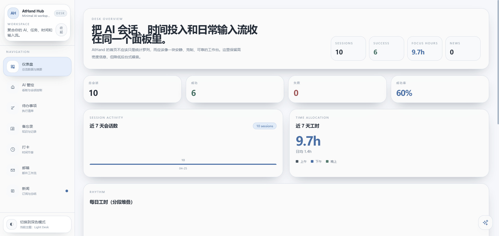
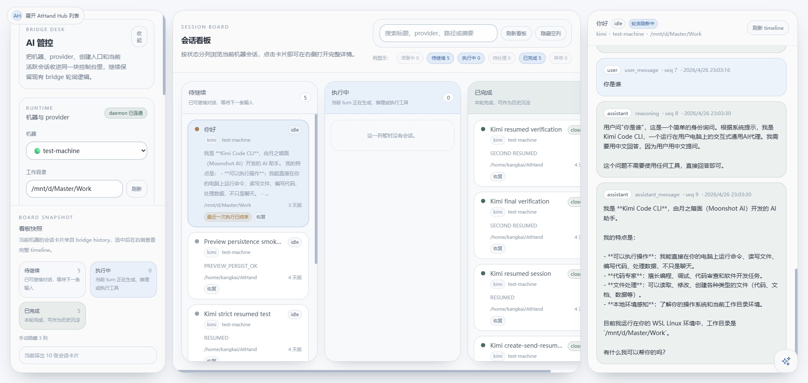
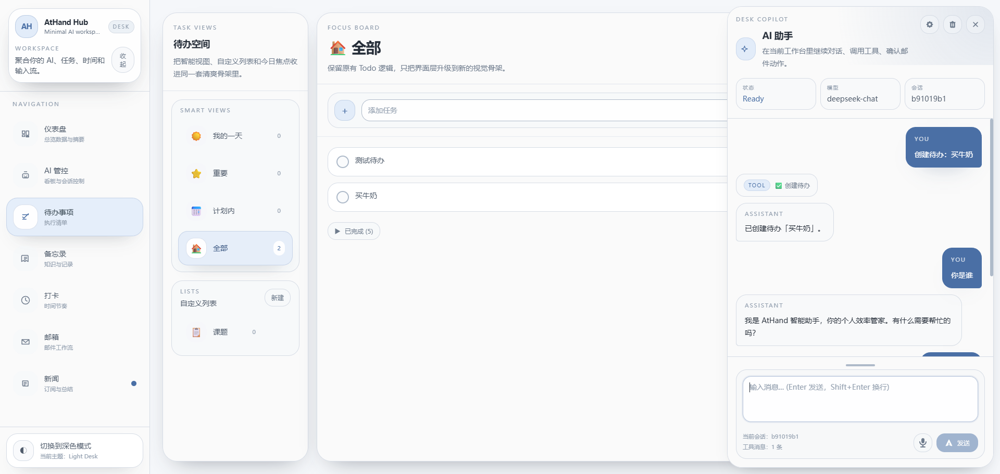
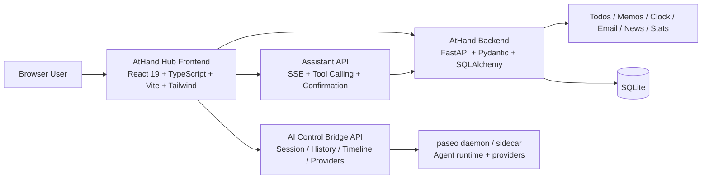

# AtHand

<p align="center">
  <strong>AI 原生远程工作台，用于 Agent 编排与个人执行流协作</strong>
</p>

<p align="center">
  <a href="README.en.md">English Version</a>
  ·
  <a href="athand-hub/README.md">AtHand Hub README</a>
</p>

AtHand 是一个 AI 原生的个人远程工作台。它试图把 AI 会话、多机运行时、个人执行流和信息输入流收进同一张桌面，而不是分散在多个后台、多个窗口和多个脚本里。

在本文档中：

- V1 指接入 paseo 和 vibe-kanban 之前的 AtHand
- V2 指当前已经接入 paseo、并把 AI 管控演进为 vibe-kanban 风格工作区的 AtHand

## 目录导航

- [项目概览](#项目概览)
- [版本演进](#版本演进)
- [截图预览](#截图预览)
- [系统架构](#系统架构)
- [仓库导航](#仓库导航)
- [引用说明](#引用说明)
- [设计理念](#设计理念)
- [核心能力](#核心能力)
- [技术栈](#技术栈)
- [实现说明](#实现说明)
- [本地开发](#本地开发)
- [当前状态](#当前状态)

## 项目概览

AtHand 不是一个单点功能产品，而是一套 AI-first 的日常工作台。它想解决的核心问题，是把以下三类原本割裂的系统重新组织到统一界面里：

- AI 会话、多机 runtime、provider 配置与续聊控制
- 个人执行模块：待办、备忘录、打卡、邮件、新闻、统计
- 人与 AI 协作所需的确认、继续、回看、时间线和上下文切换

项目名 AtHand 表达的是“把能力收在手边”。V1 更像带 AI 功能的个人工作台，V2 则进一步发展成一个同时服务 AI orchestration 和个人执行流的 workspace hub。

## 版本演进

| 版本 | 定义 | 核心特征 |
| --- | --- | --- |
| V1 | 接入 paseo 和 vibe-kanban 之前的 AtHand | 原始 AtHand Hub、单体工作台、旧 AI 管控链路、个人效率工具整合 |
| V2 | 当前 AtHand | paseo sidecar bridge、vibe-kanban 式 AI 看板、timeline、统一工作台壳层、内嵌 AI 助手 |

为什么要明确区分 V1 和 V2：

- V1 代表产品第一阶段，先把个人工作台与基础 AI 能力跑通
- V2 代表当前主线，把 AI runtime 正式外接到 paseo，并把 AI 管控重构为可观察、可继续、可编排的工作流
- 它们不是两个不同项目，而是同一项目的两次产品定义

## 截图预览

<table>
  <tr>
    <td width="50%">
      
    </td>
    <td width="50%">
      
    </td>
  </tr>
  <tr>
    <td align="center"><strong>仪表盘总览</strong></td>
    <td align="center"><strong>AI 管控看板</strong></td>
  </tr>
</table>

<p align="center">
  
</p>

<p align="center"><strong>内嵌 AI 助手</strong></p>

这些截图分别展示了 V2 的三个代表性界面：聚合统计首页、vibe-kanban 风格 AI 管控，以及全局内嵌助手侧边工作区。

## 系统架构



这张图对应的是当前 V2：前端仍然是统一的工作台壳层，但 AI runtime 已不再直接塞在应用内部，而是经由 bridge-first 的 API 层连接到 paseo daemon。

## 仓库导航

| 路径 | 说明 |
| --- | --- |
| [README.en.md](README.en.md) | 英文版项目总览 |
| [athand-hub/](athand-hub/) | 当前主应用，包含 FastAPI backend 与 React frontend |
| [athand-hub/README.md](athand-hub/README.md) | AtHand Hub 子项目说明 |
| [paseo-main/](paseo-main/) | 本地联调使用的 paseo 工作副本 |
| [vibe-kanban-main/](vibe-kanban-main/) | vibe-kanban 交互形态参考 |
| [docs/screenshots/](docs/screenshots/) | README 使用的项目截图资源 |

## 引用说明

- [paseo](https://github.com/getpaseo/paseo)：AtHand V2 把 paseo 作为外部 agent runtime 与 daemon 层来接入，当前仓库中的 [paseo-main/](paseo-main/) 是本地联调与桥接开发使用的工作副本。
- [vibe-kanban](https://github.com/BloopAI/vibe-kanban)：AtHand V2 的 AI 管控工作区在会话看板、工作区编排和 timeline 交互上明确参考了 vibe-kanban，当前仓库中的 [vibe-kanban-main/](vibe-kanban-main/) 是产品形态与交互设计参考副本。

## 设计理念

- AI-first，但不是 AI-only。AtHand 不把 agent 控制孤立出来，而是把它放回真实日常工作场景中。
- Human-in-the-loop。高风险动作必须保留显式确认，例如邮件发送不是自动直发，而是确认卡片驱动。
- One desk, many runtimes。用户看到的是一个统一工作台，底层则允许多机、多 provider、多条 AI 会话并行存在。
- Local-first pragmatism。项目优先追求真实可跑、快速联调和产品闭环，而不是过早平台化。
- Observable and resumable。AI 控制链路必须支持 timeline、history、继续对话和状态分层，而不是一次性 prompt 调用。

## 核心能力

- AI 管控：多机器、多 provider、创建会话、继续会话、timeline、history、会话状态看板
- 内嵌 AI 助手：全局侧边面板、SSE 流式回复、工具调用、邮件确认动作
- 个人执行模块：待办、备忘录、打卡、仪表盘统计
- 信息流模块：邮箱工作区、新闻工作区、今日速览与日报
- 统一前端壳层：sidebar + workspace + detail panel 的工作台布局，支持主题切换、局部收起和独立滚动

## 技术栈

### Frontend

- React 19
- TypeScript
- Vite 5
- React Router 6
- Tailwind CSS
- React Markdown + remark-gfm
- DOMPurify

### Backend

- FastAPI
- Pydantic v2
- SQLAlchemy 2
- Alembic
- SQLite
- python-jose + passlib
- websockets + httpx
- feedparser + BeautifulSoup

### AI Runtime 与集成层

- paseo sidecar / daemon
- 基于 WebSocket 的 bridge-first AI control 接入
- OpenAI-compatible 模型配置与切换
- vibe-kanban 启发的 session board / timeline 交互方式

## 实现说明

### 1. 前端工作台

AtHand Hub 当前是一套 SPA，核心工作区与后端边界如下：

| 工作区 | 前端入口 | 后端入口 | 说明 |
| --- | --- | --- | --- |
| 仪表盘 | `/` | `/api/stats` | 汇总本地业务数据与 AI bridge 历史 |
| AI 管控 | `/agents` | `/api/ai-control` | 多机 AI session 的创建、继续、timeline 与 provider 管理 |
| 待办 | `/todos` | `/api/todos` | 任务管理与执行清单 |
| 备忘录 | `/memos` | `/api/memos` | Markdown 记录与检索 |
| 打卡 | `/clock` | `/api/clock` | 工时记录与节奏统计 |
| 邮箱 | `/email` | `/api/email` | 账号、文件夹、邮件列表与写信工作流 |
| 新闻 | `/news` | `/api/news` | 订阅源、资讯流、速览与日报 |
| 内嵌助手 | 全局侧边面板 | `/api/assistant` | SSE 对话、工具调用、动作确认 |

### 2. AI 管控链路

V2 的关键变化，是把 AI 管控改造成 bridge-first 的 paseo 接入链路：

1. 前端 `/agents` 页面负责看板、列表、timeline 和继续对话入口。
2. FastAPI 在 `/api/ai-control` 暴露机器列表、provider 列表、创建会话、发送消息、恢复会话、timeline 和 history 等接口。
3. [athand-hub/backend/services/ai_control_bridge.py](athand-hub/backend/services/ai_control_bridge.py) 作为桥接层，把 AtHand API 模型转换为 paseo daemon 的 WebSocket RPC。
4. paseo 负责真正的 agent runtime 与 provider 接入。
5. 前端再把这些运行态组织成 vibe-kanban 风格的工作台。

这使 AtHand 不再只是“带一个 AI 按钮的工具箱”，而是开始拥有完整的 agent orchestration 形态。

### 3. 内嵌 AI 助手

内嵌助手不是独立产品，而是 AtHand 的全局协作入口：

- 前端通过全局 `AssistantPanel` 常驻挂载，任何页面都能继续对话。
- 后端 `/api/assistant/chat` 通过流式返回，把文本、tool call、tool result 和邮件确认事件推给前端。
- 工具调用可以联动待办、打卡、备忘录、统计、邮件等模块。
- 对发送邮件这类高风险动作，前端会进入确认卡片，再由用户决定发送、修改或取消。

### 4. 数据与后台任务

- 业务数据主要存放在 SQLite。
- FastAPI 启动时会拉起 email scheduler 和 news scheduler。
- Dashboard 同时汇总本地业务数据与 AI bridge history，因此既是生产力总览，也是 AI 使用总览。
- 构建后的前端资源可以由 FastAPI 直接静态托管，并对非 `/api`、非 `/ws` 路由做 SPA fallback。

## 本地开发

### 1. 启动 AtHand backend

```bash
cd athand-hub/backend
.venv/bin/python -m uvicorn main:app --host 127.0.0.1 --port 8000
```

### 2. 启动 paseo daemon

```bash
cd paseo-main
PASEO_HOME=/home/kangkai/AtHand/.paseo-athand \
PASEO_LISTEN=127.0.0.1:6767 \
PASEO_RELAY_ENABLED=0 \
PASEO_DICTATION_ENABLED=0 \
PASEO_VOICE_MODE_ENABLED=0 \
PASEO_NODE_INSPECT=0 \
npx -y -p node@22 -p npm@10 bash -lc 'npm run dev --workspace=@getpaseo/server -- --no-mcp'
```

### 3. 启动前端

```bash
cd athand-hub/frontend
npm run dev -- --host 127.0.0.1 --port 5173
```

开发态下，Vite 会把 `/api` 和 `/ws` 代理到 `127.0.0.1:8000`。paseo daemon 默认监听 `127.0.0.1:6767`。

## 当前状态

- 如果按演进阶段拆分，接入 paseo 和 vibe-kanban 之前的 AtHand 即 V1。
- 当前仓库主线记录的是 V2：bridge-first AI 管控、统一工作台前端、内嵌 AI 助手以及更完整的个人工作流模块。
- 这让 AtHand 从“带 AI 功能的个人工具箱”，演进成“既能编排 AI，又能承载个人执行流的工作台”。

